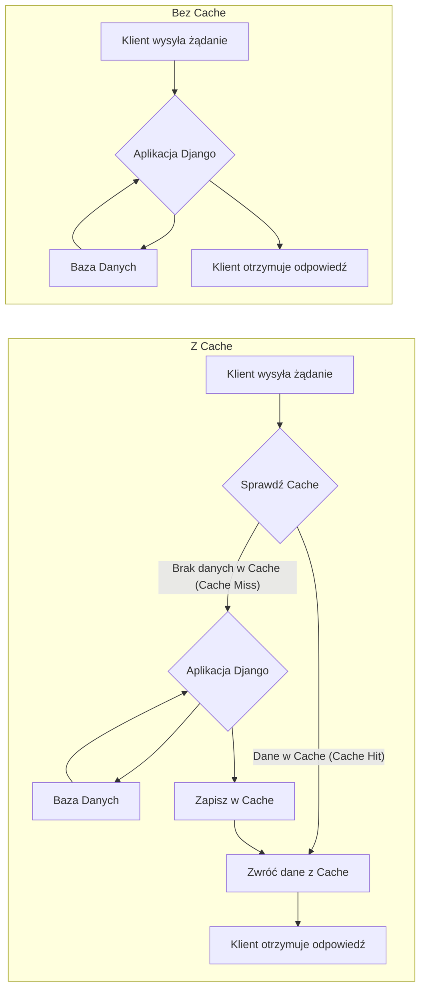
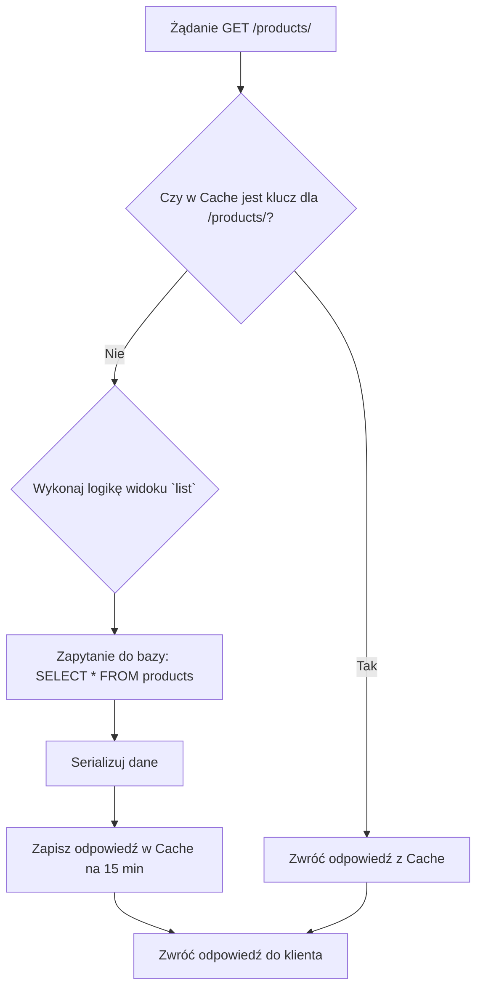
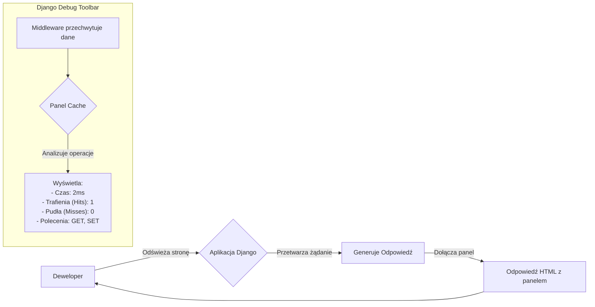

# **Lekcja 27: Cache w Django REST Framework**

`#lekcja` `#python` `#django` `#drf` `#cache` `#performance` `#optymalizacja`

W tej lekcji dowiemy się, czym jest mechanizm cache (pamięci podręcznej) i jak go używać w Django i Django REST Framework do znacznego przyspieszenia naszej aplikacji. Zrozumiemy, jak prosta konfiguracja może odciążyć bazę danych i skrócić czas odpowiedzi serwera.

## **1. Czym jest Cache i jak go skonfigurować?**

Każde żądanie do naszej aplikacji, które wymaga odpytania bazy danych, jest stosunkowo kosztowne pod względem czasu i zasobów. Jeśli dane nie zmieniają się często, po co za każdym razem pytać o nie bazę? Możemy je raz pobrać, zapisać w szybkim magazynie (pamięci podręcznej) i serwować kolejne żądania właśnie z tego magazynu.

> [!definition]
> 
> Cache (pamięć podręczna) to mechanizm przechowywania danych w tymczasowym, szybkim magazynie, aby przyszłe żądania dotyczące tych samych danych mogły być obsłużone szybciej. Zamiast wykonywać kosztowne operacje (np. zapytania do bazy danych), aplikacja najpierw sprawdza, czy odpowiedź znajduje się w cache.

Głównym celem jest zredukowanie opóźnień i zmniejszenie obciążenia serwera oraz bazy danych.


 


### **Konfiguracja w `settings.py`**

Django oferuje kilka "backendów" dla pamięci podręcznej. Konfigurujemy je w pliku `settings.py` w słowniku `CACHES`.

> [!info]
> 
> Django domyślnie używa lokalnej pamięci podręcznej dla każdego procesu (locmem), która jest bardzo szybka, ale nie jest współdzielona między procesami serwera. Jest idealna do celów deweloperskich.

Przykład 1: Cache w pamięci (dla deweloperów)

To najprostszy typ cache. Każdy proces Pythona będzie miał swoją własną, prywatną instancję cache.

```python
# settings.py

CACHES = {
    'default': {
        'BACKEND': 'django.core.cache.backends.locmem.LocMemCache',
        'LOCATION': 'unique-snowflake', # Nazwa unikalna dla instancji
    }
}
```

Przykład 2: Cache oparty na systemie plików

Django będzie przechowywać zbuforowane dane w plikach na serwerze.

```python
# settings.py

import os

CACHES = {
    'default': {
        'BACKEND': 'django.core.cache.backends.filebased.FileBasedCache',
        'LOCATION': os.path.join(BASE_DIR, 'django_cache'), # Ścieżka do katalogu z plikami cache
    }
}
```

Przykład 3: Cache w bazie danych

Można używać bazy danych jako magazynu cache, ale jest to najwolniejsza z opcji i rzadko zalecana.

```python
# settings.py

CACHES = {
    'default': {
        'BACKEND': 'django.core.cache.backends.db.DatabaseCache',
        'LOCATION': 'my_cache_table', # Nazwa tabeli w bazie danych
    }
}
```

Przed użyciem należy stworzyć tabelę w bazie komendą: `python manage.py createcachetable`.


## Memcached

Najpopularniejszą opcją używaną w praktyce jest Redis lub Memcached działający jako lokalny serwer obok maszyny.

### Instalacja:

Instalacja biblioteki:
`pip install pymemcache`

Uruchomienie serwisu w docker:
`docker run -d --name memcached -p 11211:11211 memcached`
###  Konfiguracja

```python
# settings.py
CACHES = {
    "default": {
        "BACKEND": "django.core.cache.backends.memcached.PyMemcacheCache",
        "LOCATION": "127.0.0.1:11211",
    }
}
```

## Lub dla linuxa:
### Instalacja:
`sudo apt update`

`sudo apt install memcached libmemcached-tools`

### uruchomienie

`sudo systemctl start memcached`

`sudo systemctl enable memcached`

Sprawdzenie czy działa:
`netstat -tulnp | grep 11211`


> [!tip]
> 
> W środowiskach produkcyjnych najczęściej używa się zewnętrznych, dedykowanych systemów cache, takich jak Memcached lub Redis. Są one niezwykle szybkie i skalowalne. Konfiguracja jest podobna, wymaga jedynie podania adresu serwera cache.

## **2. Zarządzanie Cachem i Strategie**

Mamy kilka poziomów, na których możemy implementować caching.

### **Cache na poziomie widoku (`@cache_page`)**

Najprostszym sposobem na dodanie cache jest użycie dekoratora `@cache_page` od Django. Dekorator ten automatycznie buforuje odpowiedź całego widoku na określony czas.

> [!definition]
> 
> Dekorator @cache_page(timeout) przyjmuje jeden argument: timeout w sekundach, który określa, jak długo strona ma być przechowywana w pamięci podręcznej.

```python
# views.py
from django.views.decorators.cache import cache_page
from rest_framework.decorators import api_view
from rest_framework.response import Response
from .models import Product

@cache_page(60 * 15) # Cache na 15 minut
@api_view(['GET'])
def product_list(request):
    # Ta część kodu wykona się tylko wtedy, 
    # gdy odpowiedzi nie ma w cache.
    products = Product.objects.all()
    # ... skomplikowana logika, serializacja ...
    data = {"products": list(products.values())}
    return Response(data)
```

Dla widoków opartych na klasach (CBV) lub ViewSetów z DRF, dekorator można zastosować przy użyciu `method_decorator`.

```python
# views.py
from django.utils.decorators import method_decorator
from django.views.decorators.cache import cache_page
from rest_framework import viewsets
from .models import Product
from .serializers import ProductSerializer

class ProductViewSet(viewsets.ReadOnlyModelViewSet):
    queryset = Product.objects.all()
    serializer_class = ProductSerializer

    # Cache dla metody `list` (GET na /products/) na 15 minut
    @method_decorator(cache_page(60 * 15))
    def list(self, request, *args, **kwargs):
        return super().list(request, *args, **kwargs)
```



### **Niskopoziomowe API Cache**

Django udostępnia również API do ręcznego zarządzania cache. Daje to pełną kontrolę nad tym, co i kiedy jest buforowane. Jest to przydatne do cachowania wyników kosztownych obliczeń, a nie całych odpowiedzi HTTP.

```python
# services.py (przykładowy plik z logiką biznesową)
from django.core.cache import cache
import time

def get_very_complex_calculation_result():
    # Definiujemy unikalny klucz dla naszego cache
    cache_key = 'complex_calculation'
    
    # Próbujemy pobrać dane z cache
    result = cache.get(cache_key)

    # Jeśli danych nie ma w cache (cache miss)
    if result is None:
        # Wykonujemy "drogą" operację
        print("Wykonuję skomplikowane obliczenia...")
        time.sleep(5) # Symulacja długiej operacji
        result = {"data": 42, "source": "Obliczone na żywo"}
        
        # Zapisujemy wynik do cache na 1 godzinę (3600 sekund)
        cache.set(cache_key, result, timeout=3600)
    else:
        print("Zwracam wynik z cache!")
        result['source'] = 'Pobrane z cache'
        
    return result

# W widoku można to wywołać:
from .services import get_very_complex_calculation_result
@api_view(['GET'])
def complex_view(request):
    data = get_very_complex_calculation_result()
    return Response(data)
```

Cache w templeta'ach
```html


<!DOCTYPE html>
<html lang="pl">
<head>
    <title>Magazyn</title>
</head>
<body>
    <h1>Panel Magazynu</h1>

    
        <div class="sidebar">
            <h3>Kategorie towarów</h3>
            <ul>
                
                    <li>{{ category.name }}</li>
                
            </ul>
        </div>
    

    <div class="content">
        <p>Aktualny czas serwera: </p>
    </div>
</body>
</html>
```
```html


<div class="product-card">

<h2>{{ product.name }}</h2>

<p>Cena: {{ product.price }} PLN</p>

<p>Stan: {{ product.stock }} szt.</p>

</div>



```
> [!tip]
> 
> AI i Cache Invalidation
> 
> Jednym z największych wyzwań w cachingu jest jego unieważnianie (invalidation) - wiedza, kiedy usunąć stare dane. Można tu wykorzystać proste modele AI/ML do predykcji. Na przykład, jeśli model zauważy, że dane o produkcie X są najczęściej aktualizowane w piątki rano, system mógłby automatycznie unieważnić cache dla tego produktu tuż przed tym czasem, aby zapewnić użytkownikom najświeższe dane, jednocześnie utrzymując cache przez resztę tygodnia. To zaawansowana technika, ale pokazuje potencjał łączenia AI z optymalizacją systemów.

## **3. Django Debug Toolbar**

Skąd wiedzieć, czy nasz cache działa poprawnie? Z pomocą przychodzi `django-debug-toolbar` – niezwykle przydatne narzędzie deweloperskie.

> [!info]
> 
> Django Debug Toolbar to panel wyświetlany na stronie podczas developmentu, który dostarcza szczegółowych informacji o bieżącym żądaniu/odpowiedzi, w tym o zapytaniach do bazy danych, użytych szablonach, ustawieniach, a także – o operacjach na cache.

### **Instalacja i Konfiguracja**

1. **Instalacja:**
    
    ```python
    pip install django-debug-toolbar
    ```
    
2. **Dodanie do `INSTALLED_APPS` w `settings.py`:**
    
    ```python
    INSTALLED_APPS = [
        # ...
        'django.contrib.staticfiles',
        # ...
        'debug_toolbar', # Dodaj tutaj
    ]
    ```
    
3. **Dodanie Middleware w `settings.py`:**
    
    ```python
    MIDDLEWARE = [
        # ...
        'debug_toolbar.middleware.DebugToolbarMiddleware', # Dodaj jak najwyżej, ale po GZipMiddleware
        # ...
    ]
    ```
    
4. **Skonfigurowanie `INTERNAL_IPS` w `settings.py`:**
    
    ```python
    INTERNAL_IPS = [
        '127.0.0.1',
    ]
    ```
    
5. **Dodanie URL-i w głównym pliku `urls.py` projektu:**
    
    ```python
    from django.urls import path, include
    
    urlpatterns = [
        # ...
        path('__debug__/', include('debug_toolbar.urls')),
    ]
    ```
    

Po odświeżeniu strony aplikacji, po prawej stronie powinien pojawić się panel. W zakładce "Cache" znajdziesz listę wszystkich operacji na cache wykonanych podczas jednego żądania, czas ich trwania, oraz czy był to "hit" czy "miss".



![[Screenshot 2025-10-08 at 11.39.55.png]]


## **🧪 Zadania do samodzielnej pracy**

### **Zadania proste**

1. ✏️ Zadanie 1 – Konfiguracja locmem cache
    
    W swoim projekcie Django, w pliku settings.py, skonfiguruj domyślny cache tak, aby używał django.core.cache.backends.locmem.LocMemCache. Uruchom serwer, aby upewnić się, że aplikacja startuje bez błędów.
    
    (proste)
    
2. ✏️ Zadanie 2 – Instalacja Django Debug Toolbar
    
    Zainstaluj i skonfiguruj django-debug-toolbar zgodnie z instrukcjami z lekcji. Upewnij się, że panel jest widoczny w Twojej aplikacji i możesz wejść w zakładkę "Cache".
    
    (proste)
    
3. ✏️ Zadanie 3 – Cachowanie widoku API
    
    Wybierz jeden z istniejących, prostych widoków GET w Twoim API (np. lista obiektów). Za pomocą dekoratora @cache_page ustaw cache na 60 sekund. Użyj Django Debug Toolbar, aby zweryfikować, że przy pierwszym żądaniu jest "cache miss", a przy kolejnych (w ciągu 60 sekund) jest "cache hit".
    
    (proste)
    
4. ✏️ Zadanie 4 – Zabawa z niskopoziomowym API w shellu
    
    Uruchom Django shell za pomocą komendy python manage.py shell. Zaimportuj from django.core.cache import cache. Użyj cache.set('my_key', 'hello world', 30) aby ustawić wartość, a następnie cache.get('my_key') aby ją odczytać. Poczekaj 30 sekund i spróbuj odczytać ją ponownie. Co się stało?
    
    (proste)
    
5. ✏️ Zadanie 5 – Czyszczenie cache
    
    Znajdź w dokumentacji Django komendę manage.py, która pozwala na wyczyszczenie całego cache. Użyj jej w terminalu, aby usunąć wszystkie zbuforowane dane.
    
    (proste)
    

### **Zadania-wyzwania (challenge)**

6. 🧠 Zadanie 6 – Implementacja cache plikowego
    
    Zmień konfigurację cache w settings.py na FileBasedCache. Stwórz odpowiedni katalog. Użyj widoku z zadania 3. Sprawdź, czy po pierwszym odwołaniu do widoku w Twoim katalogu cache pojawiły się nowe pliki. Co zawierają te pliki?
    
    (challenge)
    
7. 🧠 Zadanie 7 – Selektywne cachowanie w widoku
    
    Stwórz widok, który pobiera dane z dwóch źródeł: jedno zapytanie do bazy, które jest proste i szybkie, oraz drugie, które symuluje bardzo skomplikowane i długie obliczenia (użyj time.sleep(3)). Użyj niskopoziomowego API cache, aby zbuforować tylko wynik tych "skomplikowanych obliczeń", a nie całą odpowiedź widoku.
    
    (challenge)
    
8. 🧠 Zadanie 8 – Różne czasy cache dla różnych metod ViewSetu
    
    Stwórz ModelViewSet dla jednego z Twoich modeli. Użyj dekoratora @method_decorator(cache_page(...)) tak, aby widok listy (list) był cachowany na 10 minut, a widok szczegółów (retrieve) tylko na 1 minutę. Metody create, update, destroy nie powinny być cachowane w ogóle.
    
    (challenge)
    
9. 🧠 Zadanie 9 – Unieważnianie cache po aktualizacji obiektu
    
    Rozszerz zadanie 8. Zaimplementuj logikę, która po każdej udanej operacji update lub partial_update na obiekcie, unieważni (usunie) klucz cache dla widoku szczegółów (retrieve) tego konkretnego obiektu. Wskazówka: sygnały Django (post_save) lub nadpisanie metody perform_update w ViewSetcie mogą być pomocne. Musisz też wiedzieć, jak Django buduje klucze cache dla widoków (może to wymagać trochę researchu lub użycia własnych kluczy).
    
    (challenge)
    
10. 🧠 Zadanie 10 – Konfiguracja Redis jako backendu cache
    
    To zadanie wymaga zainstalowania Redis na Twoim komputerze (np. przez Docker). Zainstaluj bibliotekę django-redis (pip install django-redis). Zmień konfigurację CACHES w settings.py, aby używać Redis jako backendu. Sprawdź za pomocą Django Debug Toolbar, czy Twoja aplikacja poprawnie komunikuje się z serwerem Redis. Jest to konfiguracja zbliżona do produkcyjnej.
    
    (challenge)